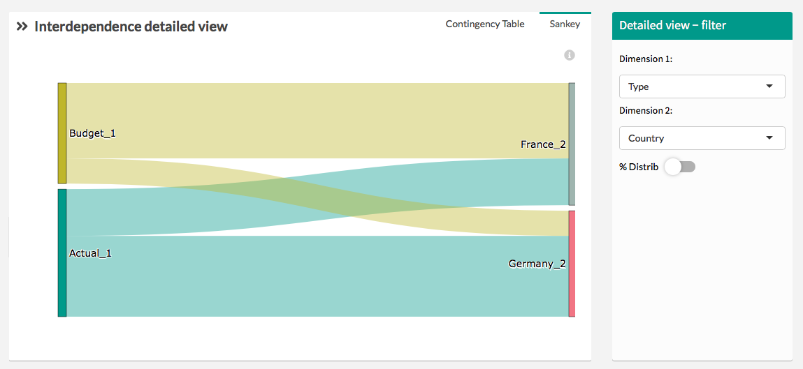

# Sankey

> This aims to discover **how dimensions are correlated**.

Show the distribution between 2 dimensions, understand for 2 dimensions how the elements of these dimensions are distributed together.

You can change dimension by using the drop-down menu on the right.

The “% distrib” option allows you to represent the distribution by percentage instead of absolute value.

This represents each element at the same size which helps you comparing the distribution.

?> The **« % Distrib »** option makes appear the segments on the right of the window all at the same size. This help to compare segment between each other.

## Sankey contigency table

This table represents the detailed value of the Sankey graph. It's the link between the two dimensions you've selected in the right menu