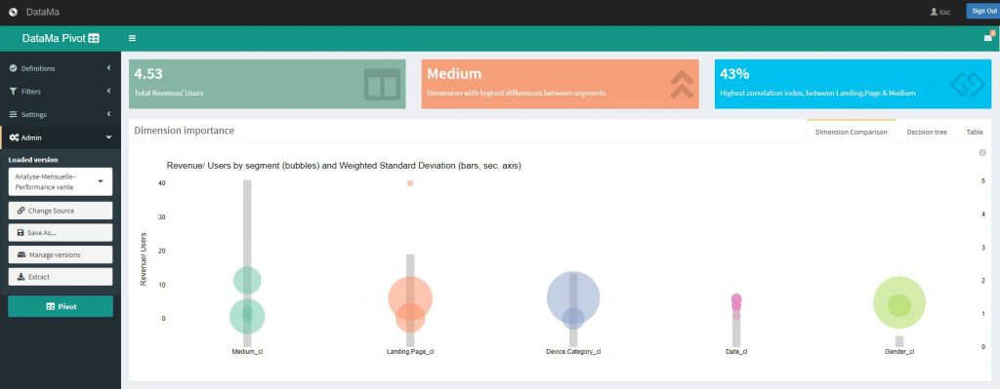
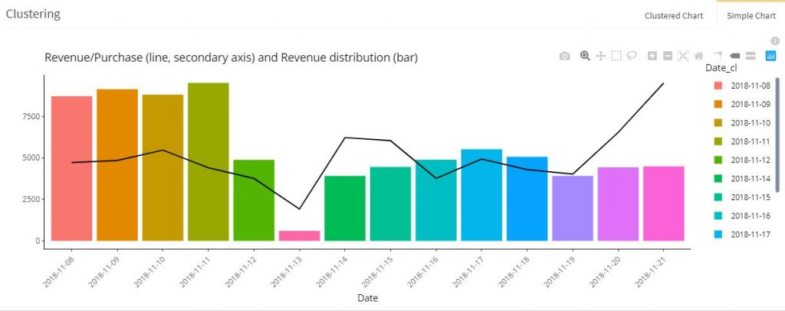

# Web performance – Google Analytics

-------------

**Find below information about the « Web – Google Analytics »  example in our [demo](http://solutions.datama.fr/) solution.**

This use case is is a basic example of conversion funel used in a eCommerce Website. This one is the Google Store website used for the Google Analytics demo, where google sales branded T-shirt and Caps…

In that specific use case, we have revenue data from 2 weeks to help the eCommerce manager understand which dimension matters when following is activities

<iframe src="https://docs.google.com/spreadsheets/d/e/2PACX-1vTXYphkUS8WX6Wa4GZp5LBisnEOoqdLyp9darrXuIJPqmsnv_f8Tvhq_0sNX7L2uVfIaJjonTP2j8Fm/pubhtml?gid=0&amp;single=true&amp;widget=true&amp;headers=false" width="880" height="450" data-mce-fragment="1"></iframe>

Access to the [Gsheet](https://docs.google.com/spreadsheets/d/1bNEeqm5CfpPmYPr_t4ff1xcJkSBKoVvwJd4vKB0sDzs/edit#gid=0)

According to the results, the web manager should first consider the Medium to follow is performance, and then Landing_Page, Device_category….and at the end Gender, the impact on the revenue is not significantly different between Male and female.

There is a significant difference of Revenue per purchase according to the date of purchase…

