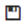

---
---

### In the header menu, you have access to several actions.

You can  
* Save your work if you click on this icon: 
* Run and cache the flow if you click on the Play Icon.
* Schedule the run of the flow if you click on the clock.
* Find the name of your flow.
* Go back to the home page of DataMa. 
