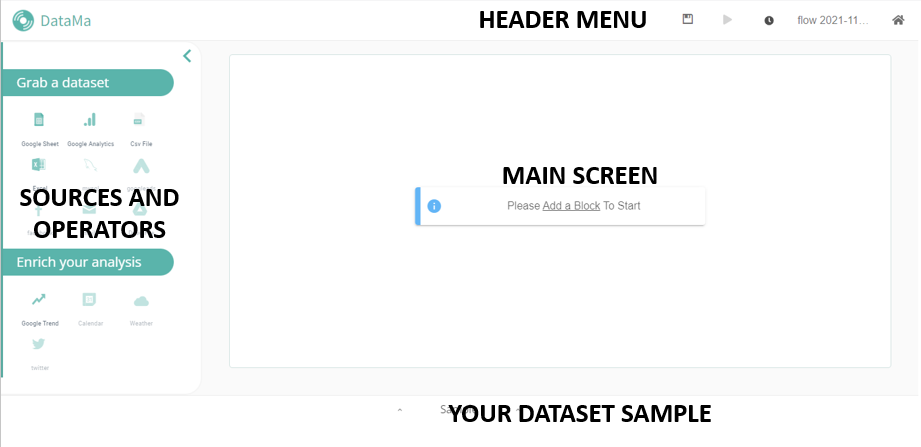

**DataMa PREP is a data aggregation tool that allows you to prepare your dataset and enrich your flow before analyzing it.**

After you have logged in, you will find this home page:

**DataMa PREP's structure is made of 4 parts:**

## Header menu
Go back to the home page, save, schedule, run and cache the flow.

See details [here]({{site.url}}/{{site.baseurl}}/prep/Header.html)

## The sources and operators
Grab your dataset and enrich your analysis.

See details [here]({{site.url}}/{{site.baseurl}}/prep/connectors/our_sources.html)

## The main screen
Use arrows and our tools to create your flow.

## Your dataset sample

You can see below your main screen your datasets uploaded. You can choose to hide it.
