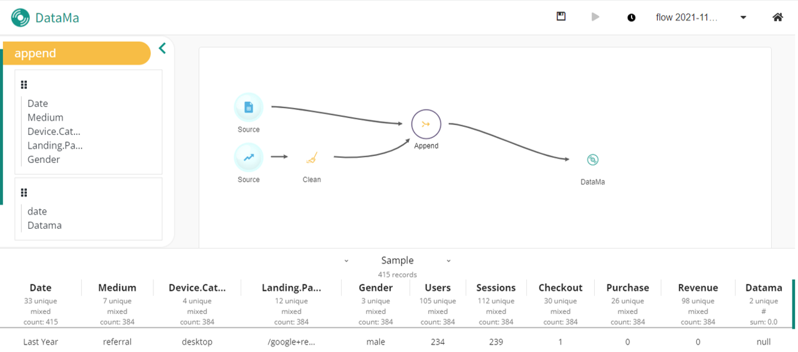

### Thanks to this option, you can cross several datasets.

You can add and cross two different datasets thanks to the option "append".

For instance, if you have input a Google sheet and a Google trend file, you might want to make a fusion of both of their data. To do so, after uploading your files, you need to append the datasets: below, you can see that the sample is uniting the dimension "Date" from the Google sheet and the dimension "date" from the Google trend extract. That is how, on the sample, "date" and "Date" become one and only dimension.

On the sidebar, you can also notice the summary of each of the dataset's dimensions.

Congrats! Your dataset is ready to be uploaded in DataMa's solution!

To see how to save and share your dataflow, click [here]({{site.url}}/{{site.baseurl}}/prep/header/Saving_and_sharing.html)
