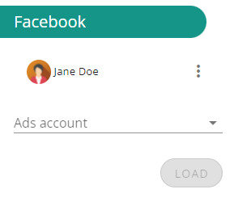
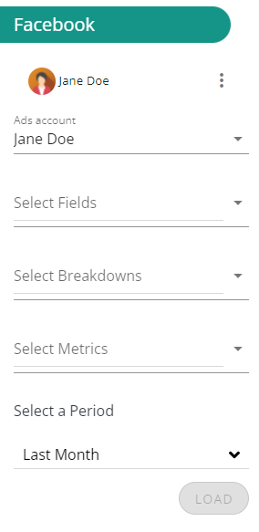

**You can upload your Facebook Analytics datasets in DataMa PREP.**

When opening the BigQuery block you can see which Google account is connected and you can disconnect it if you want to use another one.

After selecting an AdAccount you are able to create a report by selecting fields, breakdowns, metrics and a preiod.

Since reporting is by default at the level of Adsets, it is not mandatory to select fields or breakdowns.

If no field or breakdown is selected the chosen metrics will then be applied to the Adsets available for the selected AdAccount.