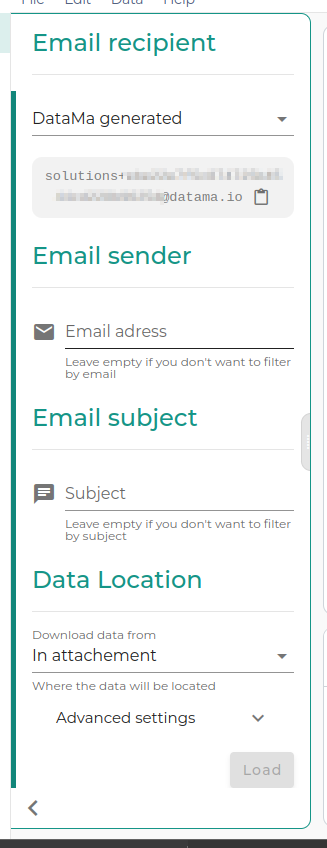

**You can plug to your Mail reports in DataMa PREP.**

# 1. Send the report first
The first step is to copy the generated email and use your reporting tool to send emails to this adress. This adress is private, and is associated with your account. When your first report is sent to this address, you are now ready to go.

# 2. Get your reports in Prep

## 2.1 When you know reports sender 
The tool used to generate reports has an email adress. For example if you set up your mail reports with Pinterest, emails will be sent via  `pinbot@info.pinterest.com`. It's this adress you need to put in the email sender box. If you don't know, just leave it blank.

## 2.2 When you know the mail subject

When you don't know the reports sender  email adress, then use the subject. For example, if you've used Pinterest as a report provider, then the subject will be `Your scheduled report`.

**Note : You can't leave both subject and email empty** 

# 3. Data Location for collection

## 3.1 Attached data
If you know that your data will be attached to the mail, then you are done !
Click on Load or setup advanced settings.

## 3.2 Data on a remote server
If your report provider gives a link to download your reports, then you need to find a constant part on those links. It's might be stored on AWS then the URL template (the constant part of the url) will be something like this `amazonaws.com`. No need to put the `http(s)` here

# 4. That's it, you're done !
Get your reports and analyze them on prep !