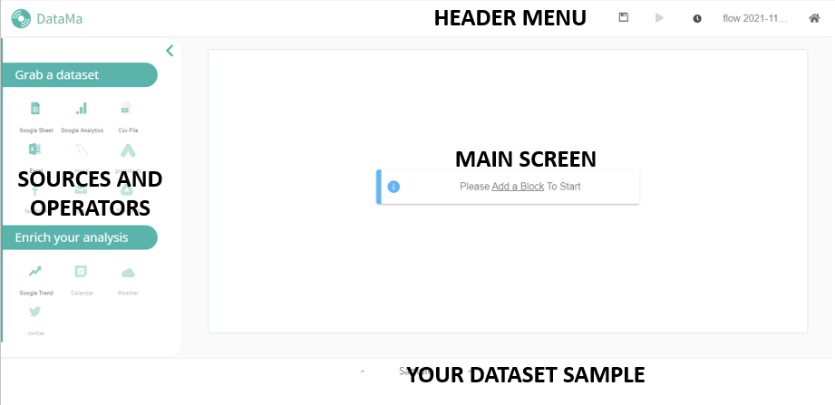

> **DataMa PREP is a data analysis tool that allows you to modify and prepare your dataset before analyzing it.**

If you're already familiar with DataMa Solutions, you will obviously need DataMa PREP one day. It will help you create a dataset compatible with DataMA's market equation.

This documentation gives you an overview of how it works and how to use it.

Hope you enjoy it.

Please visit DataMa generic [website](https://datama.fr/lets-talk/) for any other question and to hesitate to reach us if you have any question about the solution, your analysis or the documentation. We will be more than happy to get your point of view.
