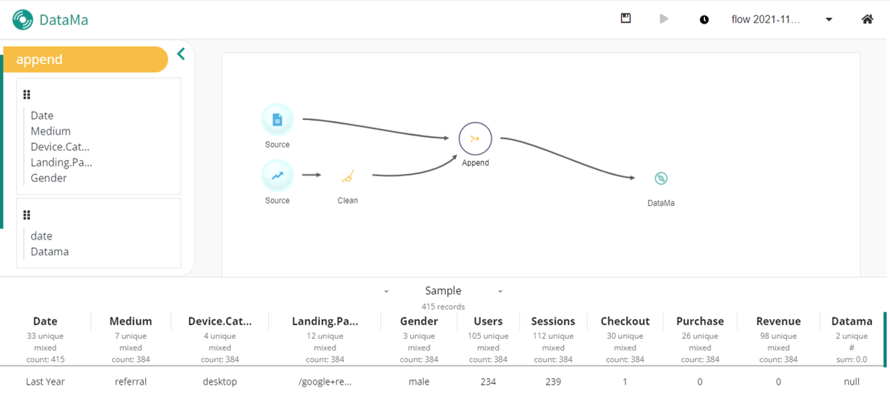

**Append action allow you to merge two source flow in one.**

### Why ? 

DataMa Prep allow you to import data from multiple source to a single output ready for DataMa Core's solutions. In order to join our multiple source we need an Append action.

### How to use it ?

For instance,
if you have input a Google sheet and a Google trend file,
you might want to make a fusion of both of their data.

To do so, in the action menu of the block where you want to merge datasets select "Append".
It will automatically merge datasets.

On the sidebar, you can also notice the summary of each of the dataset's columns.

If there are some columns shared between both dataset, it will merge them instead of duplicate them. All non-shared columns of each dataset will be seed with NULL value.

Congrats! Your dataset is ready to be uploaded in DataMa's solution!

To see how to save and share your dataflow, click [here]({{site.url}}/{{site.baseurl}}/prep/header/save.html)
