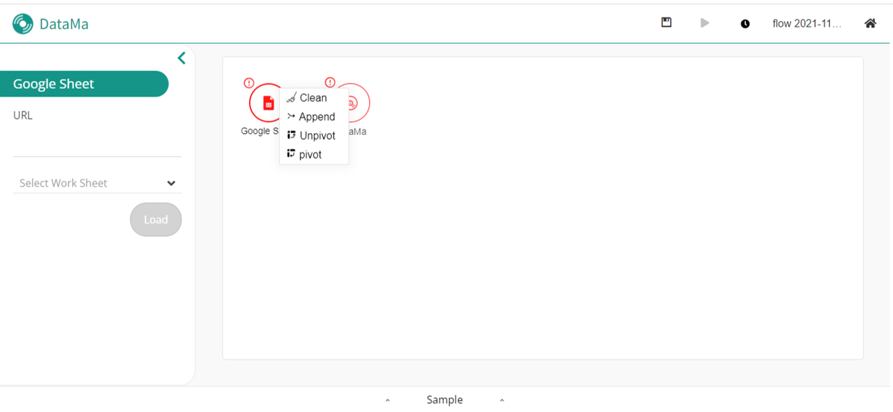
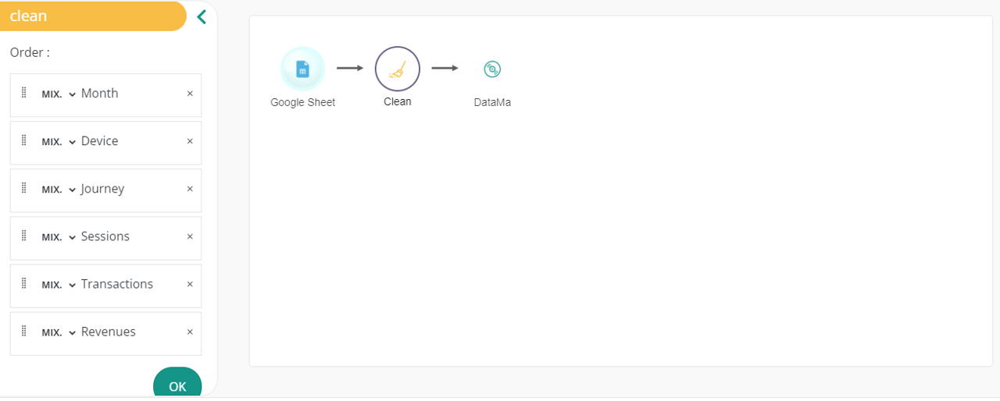
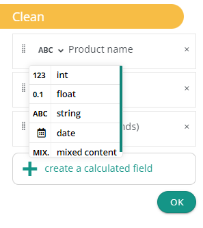
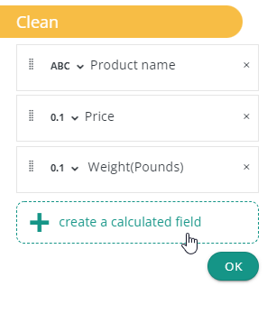
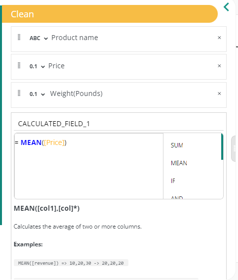
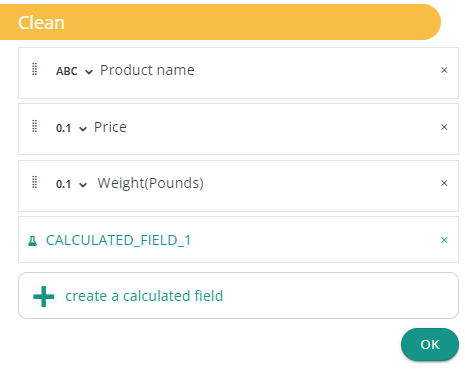

**Clean action allow you to edit order and types of your columns.**

### Why ?

Because you might need to append later on this dataset with another one, and you will have to coordinate both of their characteristics (such as the name of the metrics and dimensions, their format etc) so that they match in your dataflow afterwards. This is necessary to create a functionnal and interesting market equation, which is the foundation of DataMA's solutions.

### How to use it ?

You can adapt your dataset and transform it in the right format so that its lines and columns concur with other datasets.

In the action menu, you can select the "Clean" option to use it.

Once the block is created you will be able to see all of the existing columns generated by the previous action.

### Configuration explain

When you click on the Clean action block, you'll be able to see the configuration menu on the sidebar as a list of columns corresponding to the previous action on a dataset. Thus, you'll be able to:
- Re order dataset's columns by using Drag and Drop on items
- Rename a column by editing directly in the item it name
- Remove a column from the dataset using the &times; button

You'll also be able to edit a column type by using the select contain on items. If the conversion is not possible, for example converting a product name such as "hair dryer" to a date type, the clean action will show a warning.

In addition, DataMa prep gives you the possibility to create Calculated Field using the **Create a calculated field** button. 

This a powerfull tool to create columns using conditionals or aggregation functions without the need to manually edit your dataset.

Once you're done make sure to click on the "Ok" button to validate the creation of the calculated column.

Next is the "Append" action, click [here]({{site.url}}/{{site.baseurl}}/prep/sidebar/actions/Append.html)!
