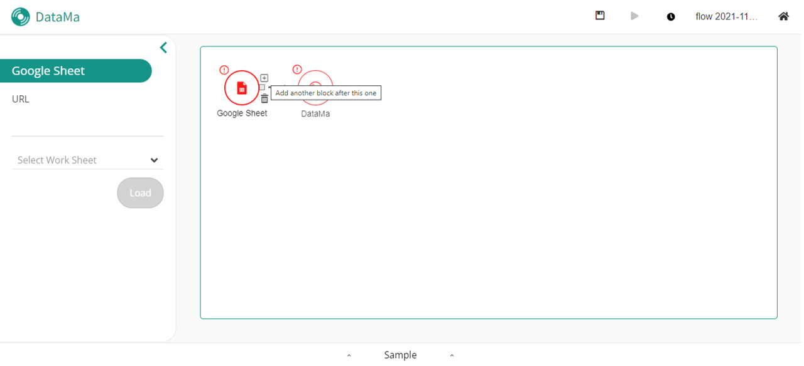

**Clean action allow you to edit order and types of your columns.**

### Why ?

Because you might need to append later on this dataset with another one, and you will have to coordinate both of their characteristics (such as the name of the metrics and dimensions, their format etc) so that they match in your dataflow afterwards. This is necessary to create a functionnal and interesting market equation, which is the foundation of DataMA's solutions.

### How to use it ?

You can adapt your dataset and transform it in the right format so that its lines and columns concur with other datasets.

In the action menu, you can select the "Clean" option to use it.

### Configuration explain

When you click on Clean action block of the chart, aside update to Clean configuration.
On the aside, you will find as list your dataset's columns. This list permit to:
- Re order dataset's columns by using Drag and Drop on items
- Rename a column by editing directly in the item it name
- Remove a column from the dataset using the &times; button
- Edit a column type by using the select contain on items
- Create Calculated Field using the **Create a calculated field** button

To understand what is the operator "Append", click [here]({{site.url}}/{{site.baseurl}}/prep/aside/actions/Append.html)!
