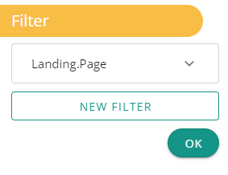
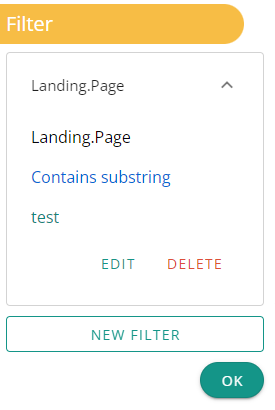

**Filter action allow you to filter data in columns.**

### Why ?

Because you might need to filter columns by the data they contain.

### How to use it ?

By using the button "new filter" you must first choose the desired column.

Then the type of filter ("exact match", "contains", ...) is displayed.

Finally you have to add one or more elements to be used to apply the filter on the column.

Once you have some filters applied you can see them by their column name. By clicking on it you open it and see a description of the filter.

Sometimes you can see the following error message "It seems that there are too many unique values" it means that the number of unique values in the dataset is higher than the limit set by DataMa.

This was implemented to avoid application performance problems.

It has the effect of not offering the unique values in the filter value selector.

### How does it work ?

Each filter is applied to the dataset in the manner of a logical AND.

If there are several keywords selected in the filter they are applied in the way of a logical OR to the data in the column.