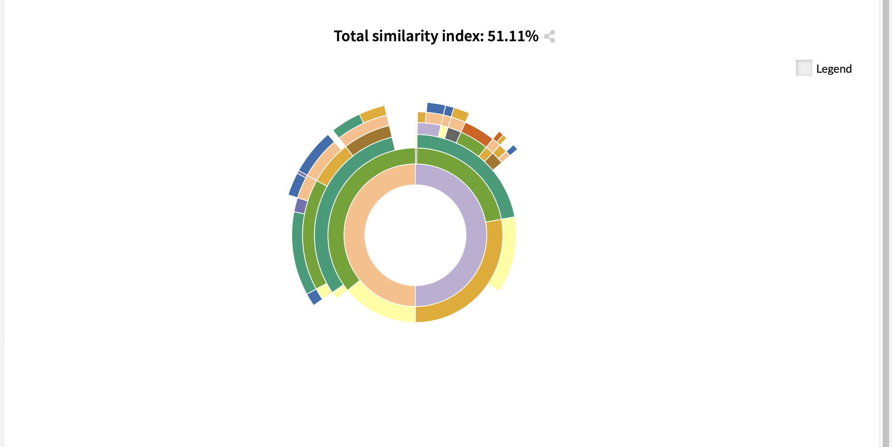

# Sunburst difference

This view is only available when Compare mode toggle is activated on DataMa Journey

**Similarity Sunburst:**

This sunburst represents the differences in appearance of the various journeys between Start and End segments.

On the right part of the sunburst (starting by "positive") are the journeys that have increased in % between start and end. You have more of this type of journeys in your End segment than what you had in your start Segment

On the left part  of the sunburst (starting by negative) are the journeys that have decreased in %

Obviously, as this is a 0 sum game, you have as much decreasing journeys than increasing ones, reason why the left part and right part (negative and positive) have exactly the same share (50/50)

